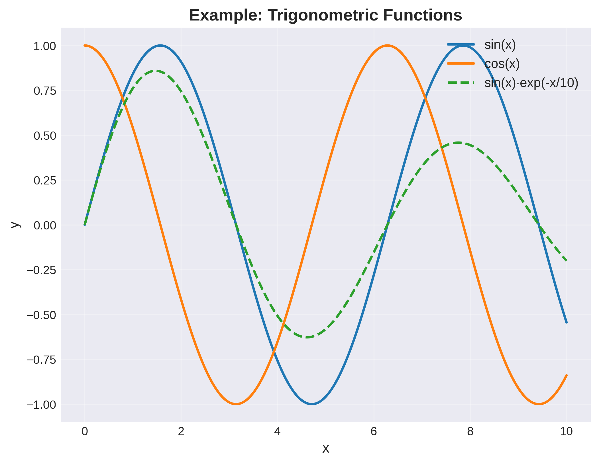

.. _`sec:methodology`:

Methodology
===========

This chapter describes the technical approach and methodology used in this white paper template system.

.. _`sec:architecture`:

System Architecture
-------------------

The documentation system consists of several integrated components:

1. **Content Layer**: Markdown files containing the written content
2. **Generation Layer**: Python scripts that create figures and tables
3. **Build Layer**: Pandoc and Make for document compilation
4. **Output Layer**: Generated documents in various formats

This modular architecture ensures that each component can be developed and maintained independently, as discussed by @examplebook2023.

.. _`sec:content-generation`:

Content Generation
------------------

.. _`sec:figures`:

Figure Generation
~~~~~~~~~~~~~~~~~

Figures are generated programmatically using Python’s matplotlib library. The generation process follows these steps:

1. Define the data and visualization parameters
2. Create the plot using matplotlib
3. Apply styling for professional appearance
4. Save to the ``../_static/figures/`` directory at high resolution (300 DPI)

For example, the sine wave shown in Figure @fig:example_plot is generated using:

.. code:: python

   x = np.linspace(0, 10, 1000)
   y = np.sin(x)
   plt.plot(x, y)
   plt.savefig('../_static/figures/example_line_plot.png', dpi=300)

   Example line plot showing trigonometric functions

.. _`sec:tables`:

Table Generation
~~~~~~~~~~~~~~~~

Tables are generated using pandas DataFrames and exported as Markdown format. This ensures:

- **Data integrity**: Tables reflect actual data values
- **Consistency**: Formatting is uniform across all tables
- **Reproducibility**: Tables can be regenerated with updated data

Table @tbl:comparison shows an example of a comparison table generated from the ``generate_tables.py`` script.

.. table:: Comparison of different methodological approaches

   ======== ============ ========== =========== ==========
   Method   Accuracy (%) Speed (ms) Memory (MB) Complexity
   ======== ============ ========== =========== ==========
   Method A 92.5         12.3       256         Low
   Method B 94.3         15.7       512         Medium
   Method C 91.8         10.2       128         Low
   Method D 95.1         18.4       1024        High
   ======== ============ ========== =========== ==========

.. _`sec:mathematics`:

Mathematical Notation
---------------------

The system supports mathematical equations using LaTeX syntax. For instance, the Gaussian function is defined as:

.. math:: f(x) = \frac{1}{\sigma\sqrt{2\pi}} e^{-\frac{1}{2}\left(\frac{x-\mu}{\sigma}\right)^2}

\ {#eq:gaussian}

where :math:`\mu` is the mean and :math:`\sigma` is the standard deviation.

More complex equations can also be included. The general form of a neural network layer computation is:

.. math:: \mathbf{y} = \sigma(W\mathbf{x} + \mathbf{b})

\ {#eq:neural}

where :math:`W` is the weight matrix, :math:`\mathbf{b}` is the bias vector, and :math:`\sigma` is the activation function.

.. _`sec:build`:

Build Process
-------------

The document build process is automated using a Makefile:

.. code:: bash

   make all      # Generate figures, tables, and PDF
   make pdf      # Build PDF only
   make html     # Build HTML version
   make clean    # Remove generated files

This automation ensures reproducibility and simplifies the workflow for authors, as noted in recent conference proceedings [@exampleconf2024].
