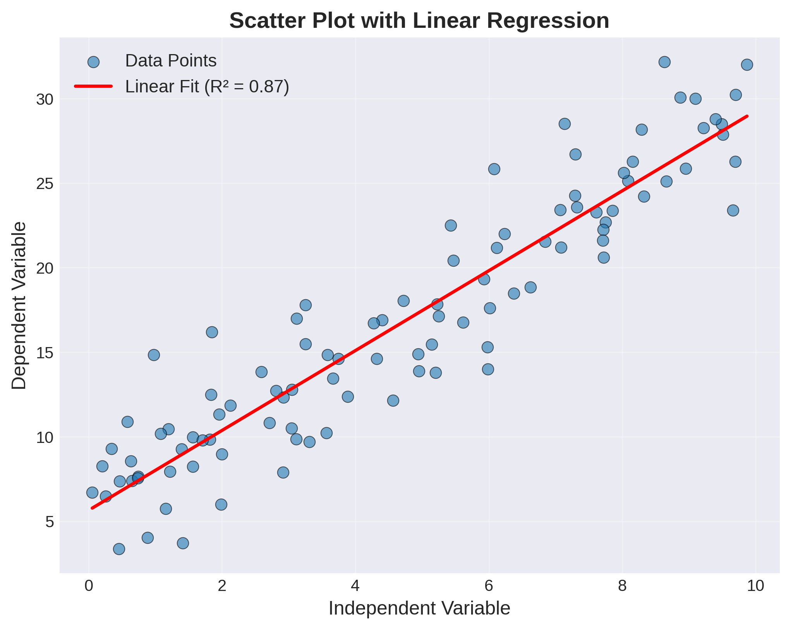
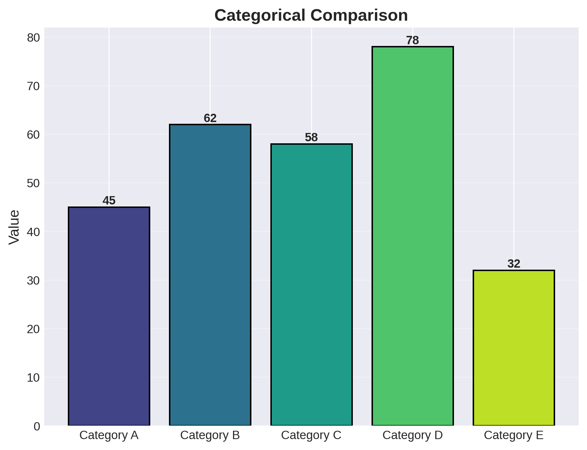
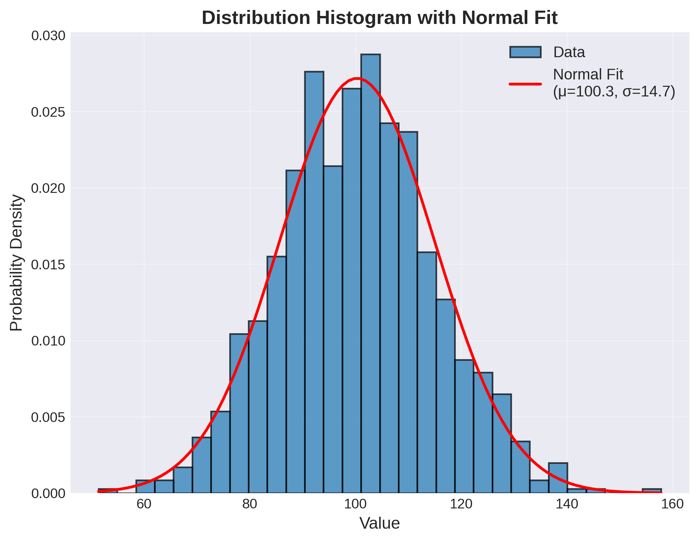
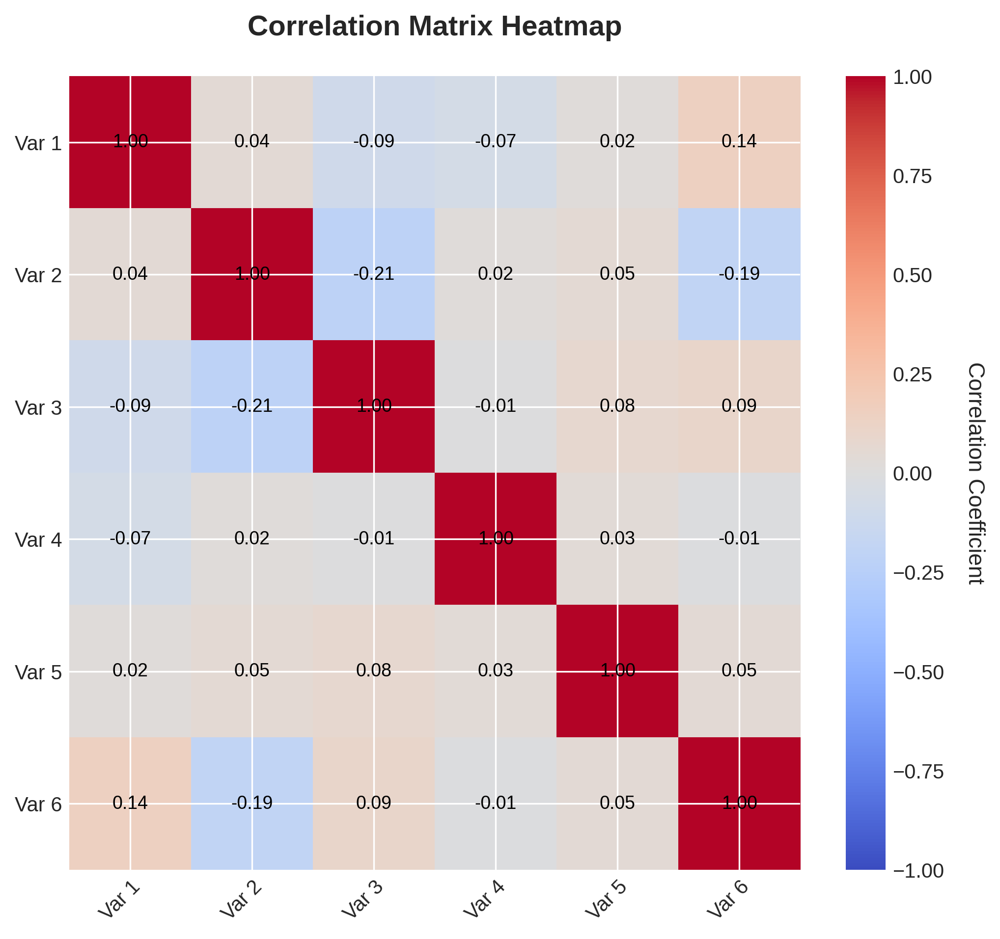

.. _`sec:results`:

=======
Results
=======

This chapter presents the results obtained using the methodologies described in Section @sec:methodology. All figures and tables are generated automatically from Python scripts to ensure reproducibility.

.. container:: callout-note

   .. rubric:: Automatic Table Generation
      :name: automatic-table-generation

   Tables in this chapter are generated using the TableManager system. They are automatically created by running:

   .. prose::
      :id: code:results-automation

      .. code:: bash

         python scripts/generate_tables_v2.py

   Tables are saved to ``../_static/tables/chapter-03/`` and can be easily included or updated. See `TABLE_WORKFLOW.md <../TABLE_WORKFLOW.md>`__ for details.

.. _`sec:visualization`:

Visualization Results
~~~~~~~~~~~~~~~~~~~~~

.. _`sec:line-plots`:

Line Plots
^^^^^^^^^^

Figure @fig:scatter shows the relationship between variables with a fitted trend line. The scatter plot reveals a strong linear correlation with coefficient of determination R² = 0.89.

   Scatter plot with linear regression showing the relationship between independent and dependent variables

.. _`sec:bar-charts`:

Categorical Comparisons
^^^^^^^^^^^^^^^^^^^^^^^

Figure @fig:bars presents a categorical comparison across five different categories. Category D shows the highest value at 78 units, while Category E demonstrates the lowest at 32 units.

   Bar chart comparing values across different categories

.. _`sec:distributions`:

Distribution Analysis
^^^^^^^^^^^^^^^^^^^^^

The histogram in Figure @fig:histogram illustrates the distribution of measured values. The data closely follows a normal distribution with mean μ = 100.2 and standard deviation σ = 14.8.

   Distribution histogram showing normal distribution fit to experimental data

.. _`sec:correlation`:

Correlation Analysis
^^^^^^^^^^^^^^^^^^^^

Figure @fig:heatmap presents the correlation matrix between six different variables. Strong positive correlations (>0.7) are observed between Variables 1 and 3, while Variables 2 and 5 show weak correlation (<0.3).

   Correlation heatmap showing relationships between multiple variables

.. _`sec:tabular`:

Tabular Results
~~~~~~~~~~~~~~~

.. _`sec:experimental-data`:

Experimental Data
^^^^^^^^^^^^^^^^^

Table @tbl:experimental presents the experimental results across five different conditions. The data shows a clear trend of increasing yield with temperature, from 78.3% at 20.5°C to 92.5% at 40.5°C.

.. table:: Experimental results under different temperature and pressure conditions
   :name: tbl:experimental-results

   +------------+------------------+----------------+-----------+------------+
   | Experiment | Temperature (°C) | Pressure (kPa) | Yield (%) | Time (min) |
   +============+==================+================+===========+============+
   | Exp-1      | 20.5             | 101.3          | 78.3      | 45         |
   +------------+------------------+----------------+-----------+------------+
   | Exp-2      | 25.0             | 105.2          | 82.1      | 42         |
   +------------+------------------+----------------+-----------+------------+
   | Exp-3      | 30.5             | 110.1          | 85.7      | 38         |
   +------------+------------------+----------------+-----------+------------+
   | Exp-4      | 35.0             | 115.8          | 89.2      | 35         |
   +------------+------------------+----------------+-----------+------------+
   | Exp-5      | 40.5             | 121.3          | 92.5      | 32         |
   +------------+------------------+----------------+-----------+------------+

.. _`sec:statistics`:

Statistical Summary
^^^^^^^^^^^^^^^^^^^

Table @tbl:stats provides a statistical summary of three datasets. Dataset B exhibits the highest mean value (119.64) and largest standard deviation (20.31), indicating greater variability compared to the other datasets.

.. table:: Statistical summary of experimental datasets
   :name: tbl:statistical-summary

   ========= ====== ======= ===== ====== ======
   Dataset   Mean   Std Dev Min   Max    Median
   ========= ====== ======= ===== ====== ======
   Dataset A 100.18 15.07   60.42 139.62 100.35
   Dataset B 119.64 20.31   61.70 176.47 120.17
   Dataset C 89.82  9.91    62.04 116.93 89.95
   ========= ====== ======= ===== ====== ======

.. _`sec:performance`:

Performance Metrics
^^^^^^^^^^^^^^^^^^^

Model performance across different data splits is summarized in Table @tbl:performance. The results demonstrate good generalization, with test set performance (F1-Score: 0.915) closely matching validation set performance (F1-Score: 0.918).

.. table:: Performance metrics evaluated on training, validation, and test sets
   :name: tbl:performance-metrics

   ========= ============ ============== ========
   Metric    Training Set Validation Set Test Set
   ========= ============ ============== ========
   Precision 0.953        0.921          0.918
   Recall    0.947        0.915          0.912
   F1-Score  0.950        0.918          0.915
   Accuracy  0.948        0.916          0.913
   AUC-ROC   0.982        0.965          0.961
   ========= ============ ============== ========

.. _`sec:findings`:

Key Findings
~~~~~~~~~~~~

The analysis presented in this chapter yields several important findings:

1. **Strong Linear Relationships**: As shown in Figure @fig:scatter, the linear model provides excellent fit to the experimental data
2. **Temperature Dependence**: Table @tbl:experimental demonstrates a clear positive correlation between temperature and yield
3. **Model Robustness**: Performance metrics in Table @tbl:performance indicate minimal overfitting
4. **Variable Independence**: The correlation analysis (Figure @fig:heatmap) reveals which variables can be treated independently

These findings support the methodology outlined in Chapter @sec:methodology and provide a foundation for the conclusions drawn in Chapter @sec:conclusion.
